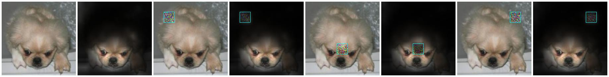
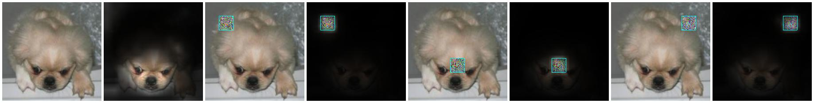

# This is a pytorch implemention of the ECCV2022 paper <br/><a href="https://arxiv.org/pdf/2111.10659.pdf">Are vision transformers robust to patch perturbations?</a>

This work discovered that ViTs are more robust to naturally corrupted patches than CNNs, whereas they are more vulnerable to adversarial patches. The reason behind this is as follows:


1) The attention mechanism can help improve the robustness of Vision Transformer by effectively ignoring natural corrupted patches. 

```
python main.py --pert_type patch_corrupt
```
The model attention of an input with natural patch corruption is visualized as follows:


2) When ViTs are attacked by an adversary, the attention mechanism can be easily fooled to focus more on the adversarially perturbed patches and cause a mistake.

```
python main.py --pert_type patch_attack
```
The model attention of an input with natural patch corruption is visualized as follows:



If this repo is helpful for you, please cite our work.
```
@inproceedings{gu2022vision,
  title={Are vision transformers robust to patch perturbations?},
  author={Gu, Jindong and Tresp, Volker and Qin, Yao},
  booktitle={European Conference on Computer Vision},
  pages={404--421},
  year={2022},
  organization={Springer}
}
```
